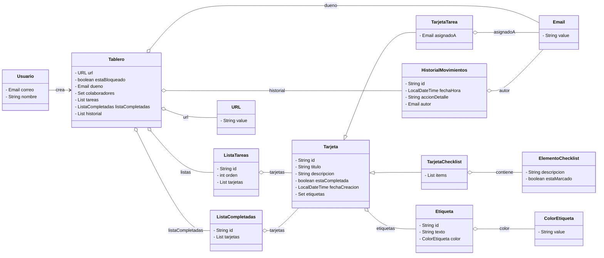

# Modelo de Dominio y Lenguaje Ubicuo

Este documento define los conceptos fundamentales de nuestra aplicación de gestión de trabajo colaborativo, basándonos en los principios de DDD. Establecer este **Lenguaje Ubicuo** asegura que tanto el código como las discusiones del equipo utilicen exactamente los mismos términos.

## Glosario de Términos

* **Usuario:** Persona identificada en el sistema mediante un correo electrónico. Puede crear tableros o colaborar en ellos.
* **Tablero:** Es el espacio de trabajo principal. Contiene listas de tareas, gestiona los accesos mediante una URL única y registra la historia de acciones. Puede cambiar a un estado "Bloqueado".
* **Lista de Tareas:** Contenedor de tarjetas dentro de un tablero. Representa una fase o estado del flujo de trabajo (ej. *TODO, DOING, DONE*).
* **Lista de Completadas:** Una lista especial dentro del tablero que contiene las tarjetas que han sido finalizadas.
* **Tarjeta:** La unidad base de la aplicación. Puede moverse entre listas, recibir etiquetas y marcarse como completada.
* **Tarjeta de Tarea:** Subtipo de tarjeta enfocada en asignar una actividad concreta a un usuario.
* **Tarjeta de Checklist:** Subtipo de tarjeta que contiene una lista de comprobación de subtareas.
* **Etiqueta:** Elemento clasificador asignado a las tarjetas. Está definida por un color y una descripción.
* **Historial de movimientos:** Registro inmutable de una acción realizada por un usuario sobre un tablero.
* **URL de Acceso:** Identificador único que actúa como mecanismo de invitación y acceso al tablero para los colaboradores.

---

