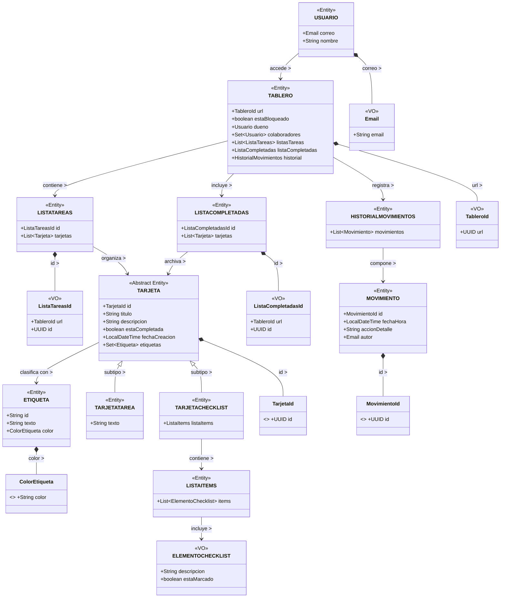

# Modelo de Dominio y Lenguaje Ubicuo

Este documento define los conceptos fundamentales de nuestra aplicación de gestión de trabajo colaborativo, basándonos en los principios de DDD. Establecer este **Lenguaje Ubicuo** asegura que tanto el código como las discusiones del equipo utilicen exactamente los mismos términos.

## Estado real del código (abril 2026)

Actualmente el repositorio utiliza un unico modelo de dominio en `com.tasku.core.domain.model`.

- La implementacion CLI fue retirada del arranque de `CoreApplication`.
- La capa de aplicacion, la capa de persistencia y los adaptadores acceden al mismo modelo unificado en `domain/model`.

## Glosario de Términos

* **Usuario:** Persona identificada en el sistema mediante un correo electrónico. Puede crear tableros o colaborar en ellos.
* **Tablero:** Es el espacio de trabajo principal. Contiene listas con limite, estado (`ACTIVE/BLOCKED`) y configuracion de comparticion por email.
* **Lista de Tareas:** Contenedor de tarjetas dentro de un tablero. Representa una fase o estado del flujo de trabajo (ej. *TODO, DOING, DONE*).
* **Lista de Completadas:** Una lista especial dentro del tablero que contiene las tarjetas que han sido finalizadas.
* **Tarjeta:** La unidad base de la aplicación. Puede moverse entre listas, recibir etiquetas y marcarse como completada.
* **Tarjeta de Tarea:** Subtipo de tarjeta con tipo `TAREA`.
* **Tarjeta de Checklist:** Subtipo de tarjeta que contiene una lista de comprobación de subtareas.
* **Etiqueta:** Elemento clasificador asignado a las tarjetas. Está definida por un color y una descripción.
* **Historial de movimientos:** Registro cronológico de acciones realizadas por usuarios sobre un tablero.
* **Movimiento:** Evento individual dentro del historial que guarda qué acción ocurrió, cuándo ocurrió y qué usuario la realizó.
* **URL de Acceso:** Identificador único que actúa como mecanismo de invitación y acceso al tablero para los colaboradores.
* **Dueño del tablero:** Usuario creador del tablero con control sobre su configuración y gestión general.
* **Colaborador:** Usuario invitado mediante URL que puede participar en el tablero según las reglas definidas.
* **Estado de bloqueo:** Condición del tablero representada con el enum `EstadoTablero`, que bloquea operaciones de modificación sobre tarjetas.
* **Elemento de checklist:** Subtarea individual de una tarjeta de checklist que puede marcarse como completada o pendiente.
* **Lista de ítems:** Colección de elementos de checklist asociada a una tarjeta de tipo checklist.
* **TarjetaId:** Identificador de valor único que distingue cada tarjeta dentro del dominio.
* **ListaTareasId:** Identificador de valor para una lista de tareas dentro de un tablero.
* **ListaCompletadasId:** Identificador de valor para la lista especial de tarjetas finalizadas.
* **Email:** Value Object que encapsula y valida el correo electrónico de un usuario.
* **Color de etiqueta:** Value Object que restringe y representa el color válido de una etiqueta.

---

Diagrama del **modelo legacy (historico, retirado)**:



---

## Explicación de los diagramas

Estos diagramas de clases representan la estructura de nuestro dominio, definiendo cómo interactúan las Entidades y los Value Objects:

* **Tablero:** Es el componente principal. Contiene las listas de tareas, la lista de tarjetas terminadas y el historial de cambios. Cada tablero tiene una `URL` única para compartirlo, un `Usuario` dueño y una colección de `Usuario` colaboradores.
* **Organización en Listas:** Un `Tablero` agrupa varias `ListaTareas` y una `ListaCompletadas`. Dentro de estas listas es donde se guardan y organizan las diferentes `Tarjetas`.
* **Tipos de Tarjetas (Herencia):** Existe una `Tarjeta` básica que guarda la información común (título, descripción, estado). De ella nacen dos tipos especiales: la `TarjetaTarea` (en legacy añade `texto`) y la `TarjetaChecklist` (que tiene subtareas que se pueden ir marcando).
* **Value Objects:** En lugar de usar texto simple (`String`) para cosas importantes, creamos clases específicas como `Email`, `TableroId` o `ColorEtiqueta` (en la etapa legacy). Así nos aseguramos de que un correo tenga formato válido o que un color sea correcto desde el momento en que se crean.
* **Etiquetas e Historial:** Las tarjetas usan `Etiqueta` para clasificarse visualmente. Por otro lado, el tablero usa el `HistorialMovimientos` como una "caja negra" para recordar qué usuario hizo cada cambio y en qué momento.
* **Usuarios:** El `Usuario` es la persona que usa la aplicación. Se identifica por su correo electrónico y puede crear sus propios tableros o colaborar en los tableros de otras personas.

---

## Historias de usuario

### Objetivo 1: Gestión de Tableros y Accesos

* **Historia 1.1: Creación de un nuevo tablero (GUI)**
  * Como usuario, quiero introducir mi correo electrónico en la pantalla inicial para poder crear un nuevo tablero de trabajo, colaborativo o no.
* **Historia 1.2: Generación y persistencia de tablero (API)**
  * Como sistema cliente (GUI), quiero enviar un correo electrónico al backend para que genere un nuevo tablero con una URL única y privada, a no ser que se quiera compartir.
* **Historia 1.3: Acceso mediante URL (GUI)**
  * Como usuario colaborador, quiero introducir la URL de un tablero en la aplicación para acceder a él y colaborar.
* **Historia 1.4: Recuperación de tablero por URL (API)**
  * Como sistema cliente (GUI), quiero solicitar al backend los datos de un tablero usando su URL para mostrarlos en pantalla.

---

### Objetivo 2: Configuración del Tablero (Listas y Bloqueos)

* **Historia 2.1: Creación y modificación de listas (GUI)**
  * Como usuario, quiero crear nuevas listas y cambiarles el nombre desde la interfaz para estructurar mi flujo de trabajo.
* **Historia 2.2: Persistencia de listas (API)**
  * Como sistema cliente (GUI), quiero enviar los datos de una nueva lista o la modificación de su nombre al backend para que se guarden.
* **Historia 2.3: Bloqueo temporal del tablero (GUI)**
  * Como usuario, quiero accionar un botón en la interfaz para bloquear temporalmente la creación de nuevas tarjetas en el tablero.
* **Historia 2.4: Gestión del estado de bloqueo (API)**
  * Como sistema cliente (GUI), quiero cambiar el estado de bloqueo de un tablero en el backend para aplicar las reglas de negocio.

---

### Objetivo 3: Gestión de Tarjetas (Tareas y Checklists)

* **Historia 3.1: Creación de tarjetas (GUI)**
  * Como usuario, quiero añadir una tarjeta nueva a una lista especificando si es una "Tarea" o un "Checklist" para definir el trabajo a realizar.
* **Historia 3.2: Creación de tarjetas y validación de reglas (API)**
  * Como sistema cliente (GUI), quiero enviar los datos de la nueva tarjeta al backend para que verifique las reglas y los guarde.
* **Historia 3.3: Mover tarjetas entre listas (GUI)**
  * Como usuario, quiero mover una tarjeta de una lista a otra para actualizar su estado de progreso.
* **Historia 3.4: Actualización de ubicación y generación de traza (API)**
  * Como sistema cliente (GUI), quiero informar al backend del movimiento de una tarjeta para que actualice su relación y registre la acción.
* **Historia 3.5: Completar tarjeta (GUI)**
  * Como usuario, quiero marcar una tarjeta como completada para quitarla de las listas activas.
* **Historia 3.6: Lógica de autocompletado (API)**
  * Como sistema cliente (GUI), quiero notificar al backend que una tarjeta se ha completado para que aplique la regla de negocio correspondiente.

---

### Objetivo 4: Etiquetas e Historial

* **Historia 4.1: Asignación de etiquetas (GUI)**
  * Como usuario, quiero asignar etiquetas de colores a las tarjetas desde su vista de detalle para clasificarlas visualmente.
* **Historia 4.2: Persistencia de etiquetas (API)**
  * Como sistema cliente (GUI), quiero enviar la asociación de una etiqueta y una tarjeta al backend para que se guarde esta relación.
* **Historia 4.3: Visualización del historial (GUI)**
  * Como usuario, quiero abrir un panel de historial para ver el registro de todas las acciones que han ocurrido en el tablero y, en caso de ser compartido, quién hizo esa acción.
* **Historia 4.4: Consulta de trazas de auditoría (API)**
  * Como sistema cliente (GUI), quiero solicitar al backend el listado de acciones históricas de un tablero.

---

## Ventajas de emplear la arquitectura hexagonal

La arquitectura hexagonal se adhiere perfectamente a los principios *S.O.L.I.D*

- **Principio de responsabilidad única (Single Responsibility):** cada capa tiene una responsabilidad única bien definida, lo cual evita mezclar responsabilidades y facilita el mantenimiento del código
- **Principio Abierto Cerrado (Open/Closed):** las entidades y caso de uso están abiertos a extension pero cerrados a modificación, si necesitamos agregar una nueva funcionalidad, podemos extender los casos de uso (nuevos adaptadores) sin modificar el código existente
- **Pincipio de sustitución de Liskov (Liskov Substitution):** los adaptadores y las implementaciones de los puertos deben ser sustituibles sin afectar al comportamiento del sistema, lo que permite cambiar facilmente entre diferentes implementaciones de infraestructura o servicios externos.
- **Principio de Segregación de Interfaces (Interface Segregation):** los puertos de entrada/salida definen interfaces pequeñas y específicas para cada funcionalidad, lo que facilita implementación de adaptadores y evita depender de interfaces innecesariamente grandes.
- **Principio de Inversión de Dependencias (Dependency Inversion):** las capas más internas no dependen de las capas más externas
  - La capa de Dominio no depende de Infraestructura o Aplicación
  - La capa de Aplicación no depende de Infraestructura
  - La capa de Infraestructura es la más externa.

---

## Implementación de la Persistencia

### 1. Tecnologías y Herramientas Utilizadas ("Qué se ha usado")

La persistencia de este proyecto se apoya en una base de datos **relacional SQL**.

| Categoría                | Implementación real en el proyecto                          | Dónde se evidencia                                                                                   |
| ------------------------- | ------------------------------------------------------------ | ----------------------------------------------------------------------------------------------------- |
| Base de datos             | **H2** en modo archivo (`jdbc:h2:file`)              | `core/src/main/resources/application.properties`                                                    |
| ORM                       | **Hibernate ORM** vía **Spring Data JPA**       | `spring-boot-starter-data-jpa` en `core/pom.xml`                                                  |
| Abstracción de acceso    | **Spring Data JPA (`JpaRepository`)**                | `SpringDataTableroRepository`, `SpringDataTarjetaRepository`, `SpringDataTrazaRepository`, etc. |
| Driver de conexión       | **org.h2.Driver**                                      | `spring.datasource.driver-class-name`                                                               |
| Consola de soporte        | **spring-boot-h2console**                              | Dependencia +`spring.h2.console.enabled=true`                                                       |
| Gestión de transacciones | **Spring Transaction Management** (`@Transactional`) | `TableroUseCaseService`, `TrazaActividadUseCaseService`                                           |

Notas técnicas:

- No se utiliza un gestor explícito de migraciones (Flyway/Liquibase) en el estado actual.
- El esquema se gestiona con `spring.jpa.hibernate.ddl-auto=update`.

Configuración activa real:

```properties
spring.datasource.url=jdbc:h2:file:./data/tasku-db;DB_CLOSE_DELAY=-1;DB_CLOSE_ON_EXIT=FALSE
spring.datasource.driver-class-name=org.h2.Driver
spring.datasource.username=sa
spring.datasource.password=

spring.jpa.hibernate.ddl-auto=update
spring.jpa.open-in-view=false

spring.h2.console.enabled=true
spring.h2.console.path=/h2-console
```

### 2. Arquitectura y Estructura de Directorios ("Cómo está estructurado")

La persistencia se implementa siguiendo DDD + arquitectura hexagonal:

1. **Dominio** define contratos (puertos) y modelo puro.
2. **Aplicación** orquesta casos de uso y transacciones.
3. **Infraestructura** implementa puertos con JPA/Hibernate.

Árbol representativo de persistencia (estado real):

```text
core/src/main/java/com/tasku/core
├─ application/tablero/usecase
│  ├─ TableroUseCaseService.java
│  ├─ TrazaActividadUseCaseService.java
│  ├─ dto/
│  └─ event/
├─ domain/board
│  ├─ exception/
│  └─ port/
│     ├─ TableroStore.java
│     ├─ ListaTableroStore.java
│     ├─ TarjetaStore.java
│     ├─ TrazaStore.java
│     └─ UsuarioStore.java
├─ domain/model
│  ├─ Tablero.java
│  ├─ ListaTablero.java
│  ├─ Tarjeta.java
│  ├─ TarjetaTarea.java
│  ├─ TarjetaChecklist.java
│  ├─ TrazaActividad.java
│  └─ CuentaUsuario.java
└─ infrastructure
   ├─ bootstrap/CoreApplication.java
   ├─ config/ProgramacionPersistenciaConfig.java
   ├─ config/CompactacionTrazasProperties.java
   ├─ scheduler/CompactacionTrazasJob.java
   ├─ events/TarjetaMovidaTrazaListener.java
   └─ persistence/jpa
      ├─ adapter/
      │  ├─ JpaTableroStoreAdapter.java
      │  ├─ JpaListaTableroStoreAdapter.java
      │  ├─ JpaTarjetaStoreAdapter.java
      │  ├─ JpaTrazaStoreAdapter.java
      │  └─ JpaUsuarioStoreAdapter.java
      ├─ repository/
      │  ├─ SpringDataTableroRepository.java
      │  ├─ SpringDataListaTableroRepository.java
      │  ├─ SpringDataTarjetaRepository.java
      │  ├─ SpringDataTrazaRepository.java
      │  └─ SpringDataUsuarioRepository.java
      ├─ entity/
      │  ├─ TableroJpaEntity.java
      │  ├─ ListaTableroJpaEntity.java
      │  ├─ TableroCompartidoJpaEntity.java
      │  ├─ TarjetaJpaEntity.java
      │  ├─ TarjetaTareaJpaEntity.java
      │  ├─ TarjetaChecklistJpaEntity.java
      │  ├─ TrazaJpaEntity.java
      │  ├─ UsuarioJpaEntity.java
      │  └─ embeddables...
      └─ mapper/
         ├─ TableroJpaMapper.java
         ├─ TarjetaJpaMapper.java
         ├─ TrazaJpaMapper.java
         └─ UsuarioJpaMapper.java
```

Propósito de los componentes clave:

- **`domain/board/port/*Store.java`**: contratos de persistencia independientes de JPA.
- **`domain/model/*`**: modelo de dominio unificado usado por aplicación y persistencia.
- **`infrastructure/persistence/jpa/adapter/*Adapter.java`**: implementación concreta de los contratos de dominio.
- **`infrastructure/persistence/jpa/repository/SpringData*Repository.java`**: capa Spring Data para CRUD/queries.
- **`infrastructure/persistence/jpa/entity/*JpaEntity.java`**: modelo de base de datos con anotaciones JPA.
- **`infrastructure/persistence/jpa/mapper/*Mapper.java`**: traducción bidireccional Dominio <-> JPA.

### 3. Implementación Paso a Paso ("Cómo se ha usado")

#### Paso 1: Configuración de la Conexión

La conexión y el wiring se configuran por propiedades + autoconfiguración de Spring Boot.

En `CoreApplication` se declara el escaneo explícito de entidades y repositorios:

```java
@SpringBootApplication(scanBasePackages = "com.tasku.core")
@EntityScan(basePackages = "com.tasku.core.infrastructure.persistence.jpa.entity")
@EnableJpaRepositories(basePackages = "com.tasku.core.infrastructure.persistence.jpa.repository")
public class CoreApplication {
  public static void main(String[] args) {
    SpringApplication.run(CoreApplication.class, args);
  }
}
```

Resultado práctico:

1. Spring crea `DataSource` (pool HikariCP).
2. Crea `EntityManagerFactory` y `JpaTransactionManager`.
3. Registra automáticamente los `SpringData*Repository`.
4. Inyecta adapters y servicios por constructor.

#### Paso 2: Modelado de Datos (Data Models/Schemas)

**Diferencia técnica en este proyecto:**

- **Entidad de Dominio**: representa reglas de negocio y no contiene anotaciones JPA.
- **Modelo de Base de Datos (JPA Entity)**: representa tablas/relaciones y sí contiene anotaciones de persistencia.

Ejemplo de entidad de dominio (sin anotaciones ORM):

```java
public abstract class Tarjeta {
  private final UUID id;
  private UUID listId;
  private final TipoTarjeta type;
  private String title;
  private String description;
  private boolean archived;
  private final Set<EtiquetaTarjeta> labels;
}
```

Ejemplo de modelo JPA (acoplado a SQL):

```java
@Entity
@Table(name = "tarjetas")
@Inheritance(strategy = InheritanceType.SINGLE_TABLE)
@DiscriminatorColumn(name = "tipo_tarjeta", discriminatorType = DiscriminatorType.STRING)
public abstract class TarjetaJpaEntity {
  @Id
  @Column(name = "id", nullable = false)
  private UUID id;

  @ManyToOne(fetch = FetchType.LAZY, optional = false)
  @JoinColumn(name = "lista_id", nullable = false)
  private ListaTableroJpaEntity list;
}
```

Además, la herencia de tarjetas se materializa con subtipos persistentes:

- `TarjetaTareaJpaEntity` (`@DiscriminatorValue("TAREA")`)
- `TarjetaChecklistJpaEntity` (`@DiscriminatorValue("CHECKLIST")`)

#### Paso 3: Implementación del Patrón Repositorio

El patrón se implementa en dos niveles:

1. **Contrato de dominio** (puerto).
2. **Adapter de infraestructura** (implementación con Spring Data).

Contrato (dominio):

```java
public interface TarjetaStore {
  Tarjeta save(Tarjeta card);
  Optional<Tarjeta> findById(UUID cardId);
  long countByListId(UUID listId);
  List<Tarjeta> findByListId(UUID listId);
}
```

Implementación (infraestructura):

```java
@Repository
public class JpaTarjetaStoreAdapter implements TarjetaStore {
  private final SpringDataTarjetaRepository repository;
  private final SpringDataListaTableroRepository boardListRepository;
  private final TarjetaJpaMapper mapper;

  @Override
  public Tarjeta save(Tarjeta card) {
    ListaTableroJpaEntity listEntity = boardListRepository.findById(card.listId())
      .orElseThrow(() -> new DomainNotFoundException("No existe la lista para persistir la tarjeta"));
    return mapper.toDomain(repository.save(mapper.toJpa(card, listEntity)));
  }
}
```

Patrón resultante:

- **Repository + Data Mapper**.
- No se usa Active Record en el dominio.

#### Paso 4: Mapeo de Datos (Mappers)

La transformación entre dominio y persistencia se concentra en:

- `TableroJpaMapper`
- `TarjetaJpaMapper`
- `TrazaJpaMapper`
- `UsuarioJpaMapper`

Ejemplo real de `TableroJpaMapper` (Dominio -> JPA):

```java
entity.setUrl(domain.url());
entity.setName(domain.name());
entity.setOwnerEmail(domain.ownerEmail());
entity.setColor(domain.color());
entity.setDescription(domain.description());
entity.setStatus(domain.status().name());
```

Ejemplo real de `TarjetaJpaMapper` para polimorfismo:

```java
if (domain instanceof TarjetaChecklist tarjetaChecklist) {
  TarjetaChecklistJpaEntity checklistEntity = new TarjetaChecklistJpaEntity();
  checklistEntity.setItems(mapItemsToJpa(tarjetaChecklist.items()));
  entity = checklistEntity;
} else if (domain instanceof TarjetaTarea) {
  entity = new TarjetaTareaJpaEntity();
}
```

Ventaja clave del mapeo explícito:

1. El dominio permanece limpio (sin `@Entity`, `@Column`, etc.).
2. Cambios de infraestructura no fuerzan cambios en reglas de negocio.
3. Se puede testear el dominio sin dependencias de ORM.

#### Paso 5: Gestión de Transacciones (Unit of Work)

No existe una clase `UnitOfWork` explícita, pero el comportamiento de unidad de trabajo se implementa con `@Transactional` de Spring.

Ejemplo de operación que usa múltiples repositorios dentro de la misma transacción:

```java
@Transactional
public Tablero createBoard(CreateBoardRequest request) {
  if (boardStore.existsByOwnerEmailAndNameIgnoreCase(request.ownerEmail(), request.name())) {
    throw new DomainConflictException("Ya existe un tablero con ese nombre para el mismo duenio");
  }

  ensureOwnerExists(request.ownerEmail()); // usa userStore
  Tablero board = Tablero.createNew(...);
  return boardStore.save(board); // usa boardStore
}
```

En este caso, la creación/aseguramiento de usuario y la persistencia del tablero comparten frontera transaccional.

También se observa transaccionalidad en:

- `createCard(...)`
- `moveCard(...)`
- `TrazaActividadUseCaseService.registerTrace(...)`
- `TrazaActividadUseCaseService.compactOlderThan(...)`

### 4. Decisiones de Diseño y Trade-offs

#### Por qué esta configuración encaja con el enfoque DDD del proyecto

1. **Puertos en Dominio + Adapters en Infraestructura**: refuerza la inversión de dependencias.
2. **Mappers explícitos**: evita contaminar el modelo de dominio con detalles del ORM.
3. **Spring Data JPA**: acelera acceso a datos y consultas sin sacrificar separación de capas.
4. **`@Transactional` en servicios de aplicación**: centraliza consistencia en casos de uso.

#### Ventajas concretas

- Alto desacoplamiento entre lógica de negocio y persistencia.
- Mayor testabilidad del dominio.
- Evolución independiente del modelo de base de datos.

#### Trade-offs reales

- Mayor volumen de código por mapeo manual (más clases y mantenimiento).
- Dependencia actual de `ddl-auto=update` (sin migraciones versionadas explícitas).
- H2 en modo archivo es excelente para desarrollo/pruebas, pero no es objetivo de producción de alta concurrencia.
