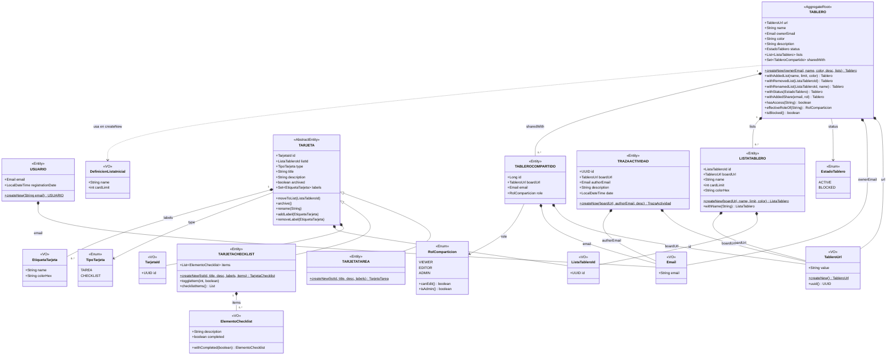

# Modelo de Dominio y Lenguaje Ubicuo

Este documento define los conceptos fundamentales de nuestra aplicación de gestión de trabajo colaborativo, basándonos en los principios de DDD. Establecer este **Lenguaje Ubicuo** asegura que tanto el código como las discusiones del equipo utilicen exactamente los mismos términos.

## Estado real del código (abril 2026)

Actualmente el repositorio utiliza un unico modelo de dominio en `com.tasku.core.domain.model`.

- La implementacion CLI fue retirada del arranque de `CoreApplication`.
- La capa de aplicacion, la capa de persistencia y los adaptadores acceden al mismo modelo unificado en `domain/model`.

## Glosario de Términos

* **Usuario:** Persona identificada en el sistema mediante un correo electrónico (`Email`) y una fecha de registro. Puede crear tableros o colaborar en ellos.
* **Tablero:** Raíz de agregado y espacio de trabajo principal. Contiene listas (`ListaTablero`), comparticiones (`TableroCompartido`), estado (`EstadoTablero`) y se identifica por su `TableroUrl`.
* **ListaTablero:** Contenedor de tarjetas dentro de un tablero. Representa una fase del flujo de trabajo (ej. *TODO, DOING, DONE*). Tiene un límite de tarjetas (`cardLimit`) y un color.
* **Tarjeta:** La unidad base de la aplicación (clase abstracta). Puede moverse entre listas, recibir etiquetas (`EtiquetaTarjeta`) y archivarse.
* **TarjetaTarea:** Subtipo concreto de `Tarjeta` con `TipoTarjeta.TAREA`. No añade campos extra al supertipo.
* **TarjetaChecklist:** Subtipo concreto de `Tarjeta` con `TipoTarjeta.CHECKLIST`. Contiene una lista de `ElementoChecklist` que se pueden marcar individualmente.
* **ElementoChecklist:** Value Object que representa una subtarea dentro de una `TarjetaChecklist`: tiene descripción y estado completado/pendiente.
* **EtiquetaTarjeta:** Value Object que clasifica visualmente una tarjeta mediante un nombre y un color hexadecimal.
* **TableroCompartido:** Entidad que registra con qué email y con qué rol (`RolComparticion`) se ha compartido un tablero.
* **TrazaActividad:** Registro de una acción ocurrida en un tablero: guarda la URL del tablero, el email del autor, una descripción y la fecha/hora.
* **TableroUrl:** Value Object que encapsula y normaliza la URL de un tablero. Acepta UUID bare o formato completo `tasku://tablero/<uuid>`.
* **Email:** Value Object que encapsula y valida el correo electrónico de un usuario (normalizado a minúsculas).
* **TarjetaId:** Value Object que identifica de forma única una tarjeta dentro del dominio (`UUID`).
* **ListaTableroId:** Value Object que identifica de forma única una lista dentro de un tablero (`UUID`).
* **DefinicionListaInicial:** Value Object usado al crear un tablero para declarar las listas iniciales (nombre + límite de tarjetas).
* **EstadoTablero:** Enum con valores `ACTIVE` y `BLOCKED`. Cuando está `BLOCKED` se impide la creación, renombrado, eliminación, completado y asignación de etiquetas en tarjetas. El movimiento de tarjetas entre listas **sí está permitido** aunque el tablero esté bloqueado.
* **TipoTarjeta:** Enum con valores `TAREA` y `CHECKLIST`. Determina el subtipo concreto de una tarjeta.
* **RolComparticion:** Enum con valores `VIEWER`, `EDITOR` y `ADMIN`. Controla los permisos de un colaborador sobre el tablero (`canEdit()`, `isAdmin()`).
* **Dueño del tablero:** Usuario cuyo email aparece como `ownerEmail` en el tablero. Su rol efectivo siempre es `ADMIN`.
* **Colaborador:** Usuario añadido a `sharedWith` del tablero con un `RolComparticion` explícito.

---

Diagrama del modelo:

---

## Explicación del diagrama

El diagrama representa la estructura real del dominio en `com.tasku.core.domain.model`, mostrando cómo interactúan entidades, value objects y enums:

* **Tablero (Aggregate Root):** Es el componente central. Contiene una lista de `ListaTablero` y un conjunto de `TableroCompartido`. Identifica su propietario solo por su `Email` (no por una referencia a `Usuario`). Sus métodos `with*` devuelven **nuevas instancias** — el objeto es inmutable.
* **ListaTablero:** Cada tablero puede tener varias listas con nombre, límite de tarjetas y color. Las tarjetas no viven dentro de la lista en el dominio; la lista solo define el contenedor. Las tarjetas referencian a su lista por `ListaTableroId`.
* **Tipos de Tarjetas (Herencia):** `Tarjeta` es una clase abstracta con todos los campos comunes (`id`, `listId`, `type`, `title`, `description`, `archived`, `labels`). `TarjetaTarea` no añade campos nuevos. `TarjetaChecklist` añade una lista de `ElementoChecklist`.
* **Value Objects:** `Email`, `TableroUrl`, `TarjetaId`, `ListaTableroId`, `EtiquetaTarjeta` y `ElementoChecklist` son records Java inmutables que validan sus valores en el constructor. Garantizan integridad desde el momento de creación.
* **Compartición y Roles:** `TableroCompartido` registra con qué email y con qué `RolComparticion` (VIEWER / EDITOR / ADMIN) se comparte el tablero. El método `effectiveRoleOf(email)` en `Tablero` devuelve ADMIN para el dueño.
* **TrazaActividad:** Registro de auditoría independiente del tablero. Se crea cuando ocurre una acción relevante (mover tarjeta, cambiar estado, etc.) y se persiste por separado.
* **EstadoTablero y TipoTarjeta:** Enums que evitan el uso de Strings mágicos para el estado del tablero y el tipo de tarjeta respectivamente.

---

## Historias de usuario

### Objetivo 1: Gestión de Tableros y Accesos

* **Historia 1.1: Creación de un nuevo tablero (GUI)**
  * Como usuario, quiero introducir mi correo electrónico en la pantalla inicial para poder crear un nuevo tablero de trabajo, colaborativo o no.
* **Historia 1.2: Generación y persistencia de tablero (API)**
  * Como sistema cliente (GUI), quiero enviar un correo electrónico al backend para que genere un nuevo tablero con una URL única y privada, a no ser que se quiera compartir.
* **Historia 1.3: Acceso mediante URL (GUI)**
  * Como usuario colaborador, quiero introducir la URL de un tablero en la aplicación para acceder a él y colaborar.
* **Historia 1.4: Recuperación de tablero por URL (API)**
  * Como sistema cliente (GUI), quiero solicitar al backend los datos de un tablero usando su URL para mostrarlos en pantalla.

---

### Objetivo 2: Configuración del Tablero (Listas y Bloqueos)

* **Historia 2.1: Creación y modificación de listas (GUI)**
  * Como usuario, quiero crear nuevas listas y cambiarles el nombre desde la interfaz para estructurar mi flujo de trabajo.
* **Historia 2.2: Persistencia de listas (API)**
  * Como sistema cliente (GUI), quiero enviar los datos de una nueva lista o la modificación de su nombre al backend para que se guarden.
* **Historia 2.3: Bloqueo temporal del tablero (GUI)**
  * Como usuario, quiero accionar un botón en la interfaz para bloquear temporalmente la creación de nuevas tarjetas en el tablero.
* **Historia 2.4: Gestión del estado de bloqueo (API)**
  * Como sistema cliente (GUI), quiero cambiar el estado de bloqueo de un tablero en el backend para aplicar las reglas de negocio.

---

### Objetivo 3: Gestión de Tarjetas (Tareas y Checklists)

* **Historia 3.1: Creación de tarjetas (GUI)**
  * Como usuario, quiero añadir una tarjeta nueva a una lista especificando si es una "Tarea" o un "Checklist" para definir el trabajo a realizar.
* **Historia 3.2: Creación de tarjetas y validación de reglas (API)**
  * Como sistema cliente (GUI), quiero enviar los datos de la nueva tarjeta al backend para que verifique las reglas y los guarde.
* **Historia 3.3: Mover tarjetas entre listas (GUI)**
  * Como usuario, quiero mover una tarjeta de una lista a otra para actualizar su estado de progreso.
* **Historia 3.4: Actualización de ubicación y generación de traza (API)**
  * Como sistema cliente (GUI), quiero informar al backend del movimiento de una tarjeta para que actualice su relación y registre la acción.
* **Historia 3.5: Completar tarjeta (GUI)**
  * Como usuario, quiero marcar una tarjeta como completada para quitarla de las listas activas.
* **Historia 3.6: Lógica de autocompletado (API)**
  * Como sistema cliente (GUI), quiero notificar al backend que una tarjeta se ha completado para que aplique la regla de negocio correspondiente.

---

### Objetivo 4: Etiquetas e Historial

* **Historia 4.1: Asignación de etiquetas (GUI)**
  * Como usuario, quiero asignar etiquetas de colores a las tarjetas desde su vista de detalle para clasificarlas visualmente.
* **Historia 4.2: Persistencia de etiquetas (API)**
  * Como sistema cliente (GUI), quiero enviar la asociación de una etiqueta y una tarjeta al backend para que se guarde esta relación.
* **Historia 4.3: Visualización del historial (GUI)**
  * Como usuario, quiero abrir un panel de historial para ver el registro de todas las acciones que han ocurrido en el tablero y, en caso de ser compartido, quién hizo esa acción.
* **Historia 4.4: Consulta de trazas de auditoría (API)**
  * Como sistema cliente (GUI), quiero solicitar al backend el listado de acciones históricas de un tablero.

---

## Ventajas de emplear la arquitectura hexagonal

La arquitectura hexagonal se adhiere perfectamente a los principios *S.O.L.I.D*

- **Principio de responsabilidad única (Single Responsibility):** cada capa tiene una responsabilidad única bien definida, lo cual evita mezclar responsabilidades y facilita el mantenimiento del código
- **Principio Abierto Cerrado (Open/Closed):** las entidades y caso de uso están abiertos a extension pero cerrados a modificación, si necesitamos agregar una nueva funcionalidad, podemos extender los casos de uso (nuevos adaptadores) sin modificar el código existente
- **Pincipio de sustitución de Liskov (Liskov Substitution):** los adaptadores y las implementaciones de los puertos deben ser sustituibles sin afectar al comportamiento del sistema, lo que permite cambiar facilmente entre diferentes implementaciones de infraestructura o servicios externos.
- **Principio de Segregación de Interfaces (Interface Segregation):** los puertos de entrada/salida definen interfaces pequeñas y específicas para cada funcionalidad, lo que facilita implementación de adaptadores y evita depender de interfaces innecesariamente grandes.
- **Principio de Inversión de Dependencias (Dependency Inversion):** las capas más internas no dependen de las capas más externas
  - La capa de Dominio no depende de Infraestructura o Aplicación
  - La capa de Aplicación no depende de Infraestructura
  - La capa de Infraestructura es la más externa.

---
