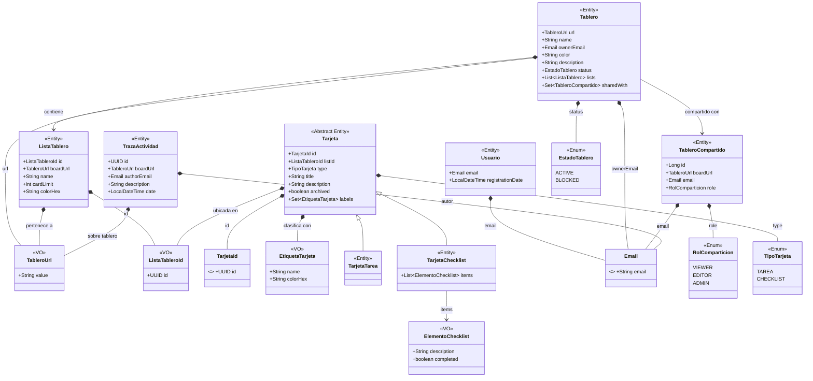

---

## Explicación del diagrama

El diagrama representa la estructura real del dominio de la aplicación (paquete `com.tasku.core.domain.model`), ilustrando cómo interactúan las entidades, los objetos de valor (*Value Objects*) y los enumerados:

* **Tablero (*Aggregate Root*):** Actúa como el componente central y raíz del agregado. Contiene una colección de elementos `ListaTablero` y un conjunto de `TableroCompartido`. Identifica a su propietario únicamente mediante el *Value Object* `Email`, sin mantener una referencia directa a la entidad `Usuario`. Su diseño es inmutable; los métodos de modificación (como `withAddedList` o `withStatus`) devuelven siempre nuevas instancias del tablero.
* **ListaTablero:** Define los contenedores dentro de un tablero, especificando su nombre, el límite de tarjetas (`cardLimit`) y su color (`colorHex`). Cabe destacar que las tarjetas no se almacenan físicamente dentro de la lista en el modelo de dominio; en su lugar, la relación se invierte y es cada tarjeta la que guarda una referencia a su lista contenedora mediante el identificador `ListaTableroId`.
* **Tipos de Tarjetas (Jerarquía y Herencia):** `Tarjeta` es una clase abstracta que agrupa todo el estado y comportamiento común, como el identificador, la lista a la que pertenece, el título, la descripción, el estado de archivado (`archived`) y un conjunto de etiquetas (`EtiquetaTarjeta`). De ella heredan:
    * `TarjetaTarea`: Representa una tarea simple y no añade atributos adicionales a la superclase.
    * `TarjetaChecklist`: Especializa el comportamiento añadiendo una lista interna de objetos `ElementoChecklist`.
* **Value Objects:** Tipos como `Email`, `TableroUrl`, `TarjetaId`, `ListaTableroId`, `EtiquetaTarjeta` y `ElementoChecklist` están implementados como *records* inmutables en Java. Su propósito es validar sus propios datos en el momento de la construcción (por ejemplo, comprobando nulos o el formato de correo), garantizando así la integridad de la información desde su creación.
* **Compartición y Roles:** La entidad `TableroCompartido` vincula el `Email` de un usuario invitado con un nivel de acceso específico definido en el enumerado `RolComparticion` (VIEWER, EDITOR, ADMIN).
* **TrazaActividad:** Constituye el registro de auditoría e historial del sistema, es una entidad totalmente independiente y desacoplada del tablero. Registra la URL del tablero afectado, el correo del autor de la acción, la descripción del evento y la fecha y hora exacta.
* **Enumerados (Enums):** `EstadoTablero` y `TipoTarjeta` sustituyen el uso de cadenas de texto (*strings mágicos*) o booleanos ambiguos, aportando seguridad de tipos en tiempo de compilación y clarificando las transiciones de estado en el dominio.
