# Manual de usuario

## 1.Interfaz gráfica

### 1.1. Login

#### 1.1.1. Menu de inicio de sesion

Para iniciar sesion, en caso de que ya seas un usuario registrado, debes introducir tu correo y pulsar el boton "Ingresar".
Si no te has registrado todavia pulsa sobre "Registrate".

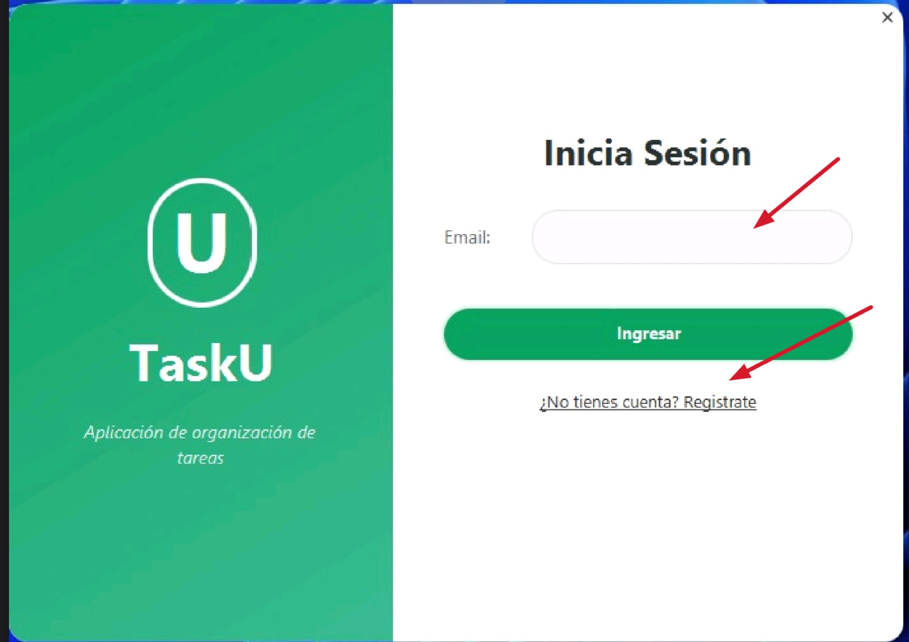

#### 1.1.2. Menu de registro

Para registrar un nuevo usuario debes introducir el correo de la cuenta y pulsar el boton de "Registrar e iniciar sesión".

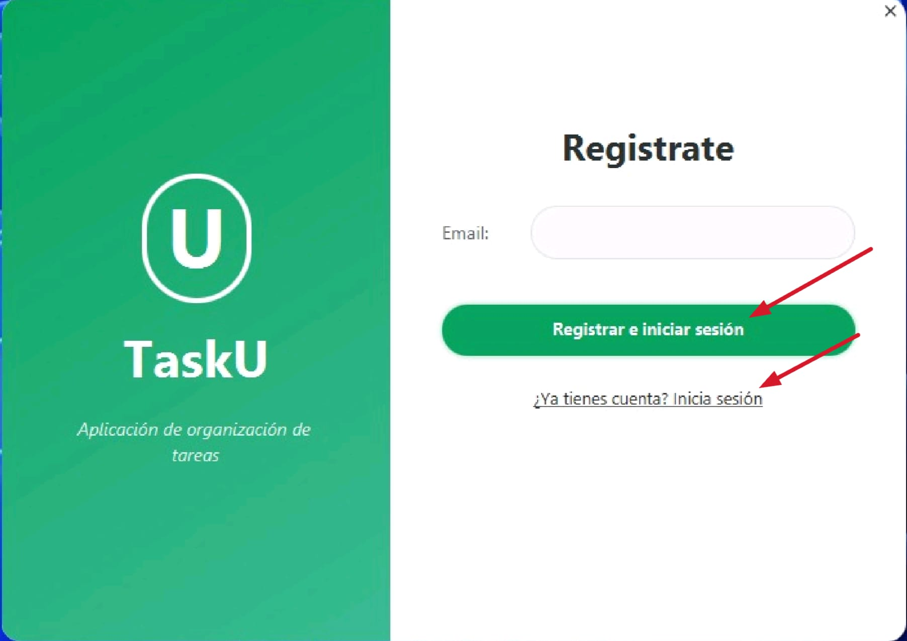

En caso de querer volvel al inicio de sesion pulsar sobre iniciar sesion

### 1.2. Pantalla principal

#### 1.2.1. Crear nuevo tablero

En caso de que seas nuevo usuario, al pulsar el boton de iniciar sesion, automaticamente aparecera la opcion de crear un nuevo tablero.

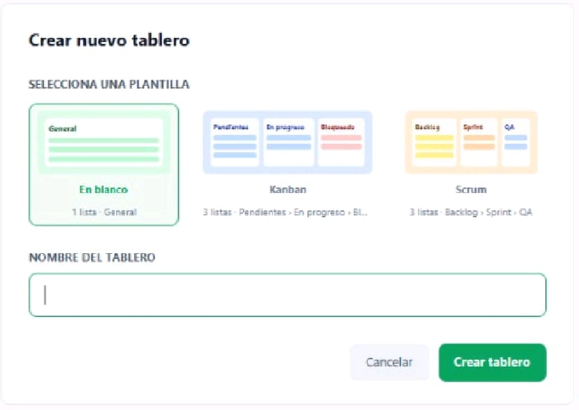

En caso de querer crear otro tablero, debes pulsar el menu de seleccion de tableros y pulsar sobre la opcion de añadir un nuevo tablero, aparecera la misma interfaz de creacion que en el caso anterior.

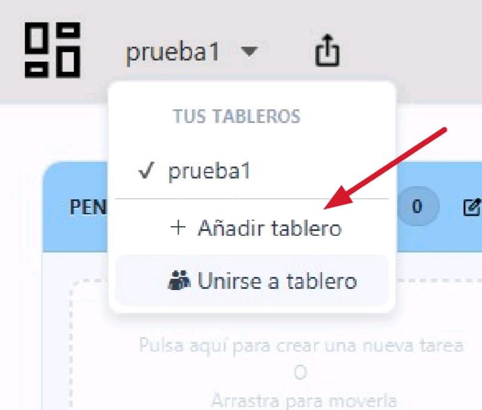

#### 1.2.2. Unirse a un tablero

En caso de tener un enlace de otro usuario que quiere compartir su tablero, debes de acceder al menu de seleccion de tableros, pulsar sobre unirse a un tablero y pegar el enlace en el cuadro de texto que lo solicita.

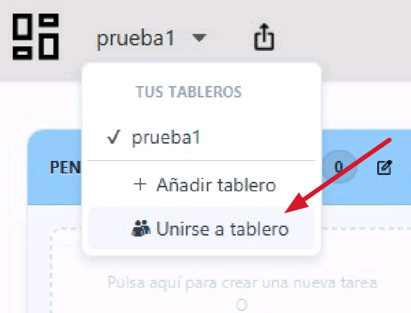

#### 1.2.3. Cambio de tablero

Estando en la pantalla principal, para cambiar de tablero, debes pulsar el menu de seleccion de tableros y pulsar sobre el nombre del tablero que quieres abrir.

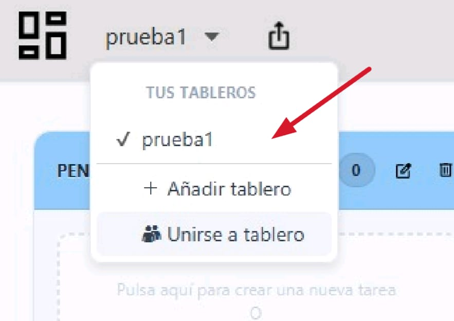

#### 1.2.4. Compartir tablero

Estando en la interfaz principal, en caso de querer compartir un tablero, debes pulsar el boton con el icono de compartir justo a la derecha del menu de seleccion de tableros.

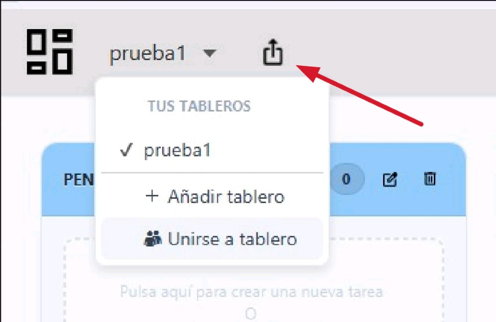

Una vez pulsado debes seleccionar los permisos, y pulsar el boton de copiar para copiar el enlace al portapapeles.

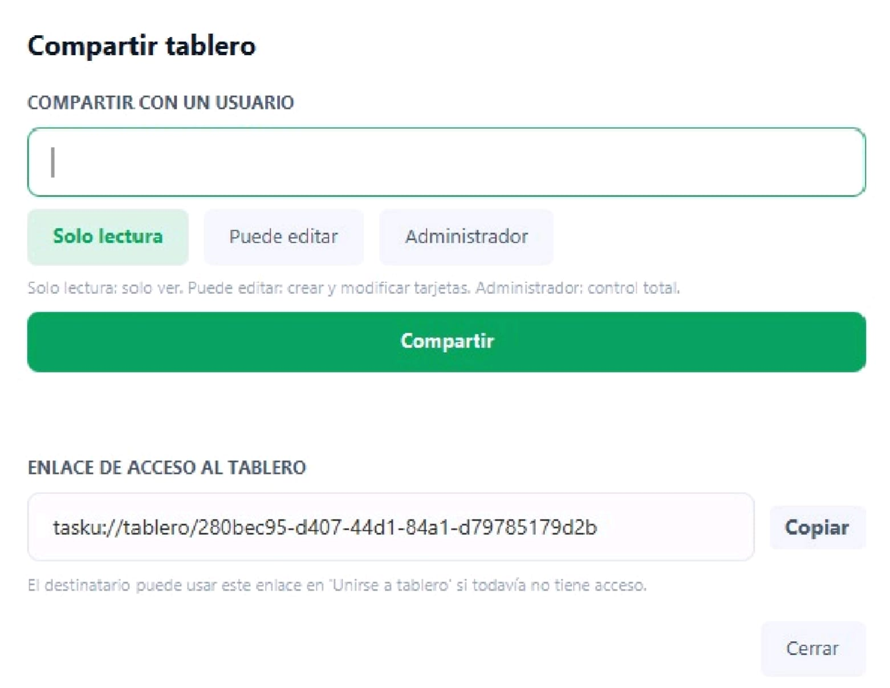

#### 1.2.5. Bloquear tablero

Para bloquear el tablero debes pulsar el boton del candado que se encuentra a la izquierda de la barra de busqueda, al pulsarlo cambiará su icono a cerrado y bloqueara la creacion de tarjetas.

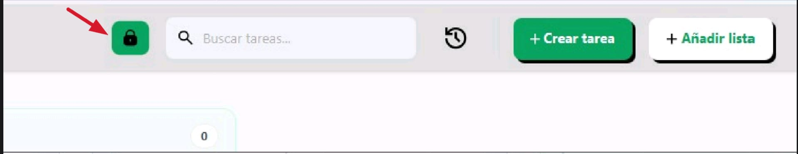

#### 1.2.6. Buscar tarjeta

Para buscar por titulo una tarjeta, debes usar la barra de busqueda, debes introducir su titulo pulsar intro, apareceran las tarjetas que contienen ese titulo.

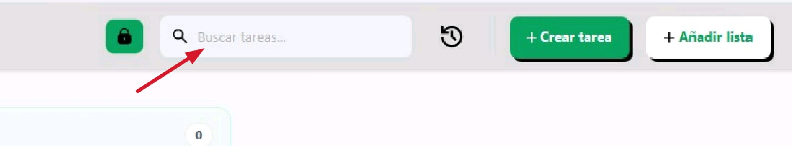

#### 1.2.7. Mirar historial

Para abrir el historial, debes pulsar el icono del reloj que se encuentra a la derecha del cuadro de busqueda.

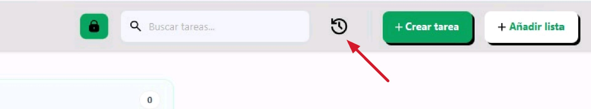

Al pulsar sobre el, se mostara una ventana scroleable de los registros de los cambios hechos en el tablero.

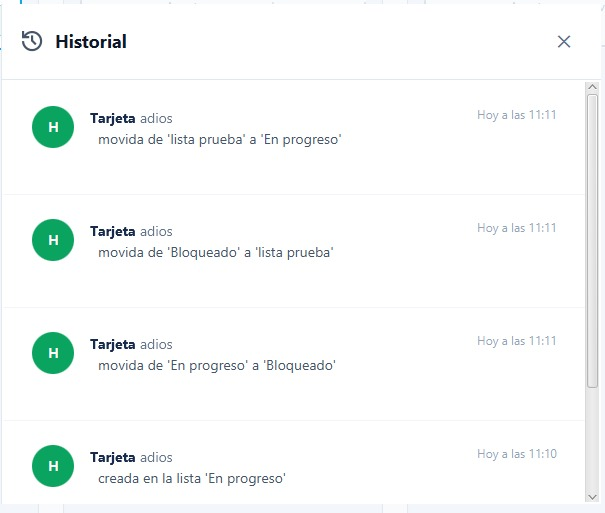

#### 1.2.8. Crear tarea

Para crear una nueva tarea hay dos formas, la primera de ella es pulsando a la derecha del historial, en el boton de "Crear tarea", y la otra forma que es pulsando en la lista en la que se quiere crear.

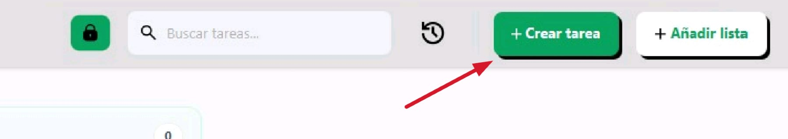

 estas dos acciones llevar al mismo menu de creacion con la particularidad de que al pulsar sobre el boton de la lista, se establece automaticamente la lista destino, siendo esto modificable.

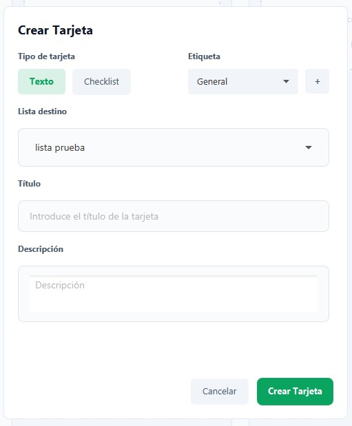

#### 1.2.8.1 Crear etiqueta

Dentro del menu de creacion de tareas, existe la opcion de asignar una etiqueta, en caso de querer crear una nueva, pulsa sobre el boton de "+" a la derecha del menu de seleccion de etiquetas.

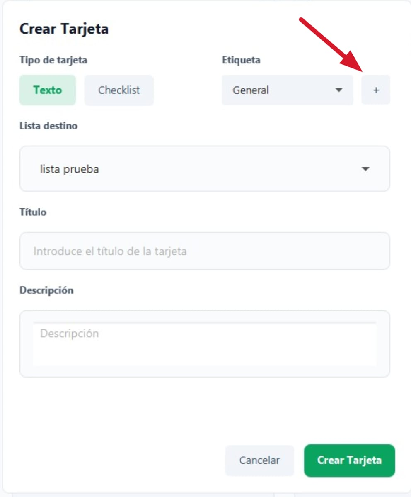

El cual nos llevara el menu de creacion de etiquetas.

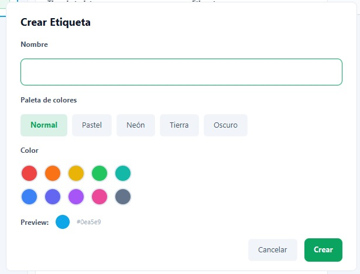

#### 1.2.8.2 Editar tarjeta

Tanto para las tarjetas de tareas como para las de checklist, se puede editar su titulo, para ello pulsamos en los tres puntos verticales de la tarjeta y pulsamos editar.

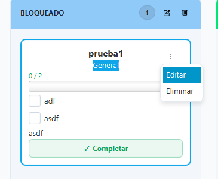

Aparece esta interfaz, en la que se puede modificar el titulo.

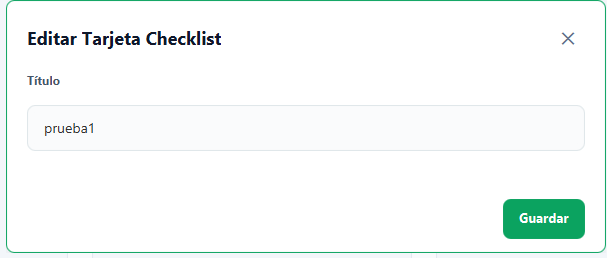

### 1.2.9. Crear lista

En la pantalla principal, para crear una nueva lista, debes pulsar el boton de "Añadir lista", el cual te llevara a la interfaz de creacion de listas.

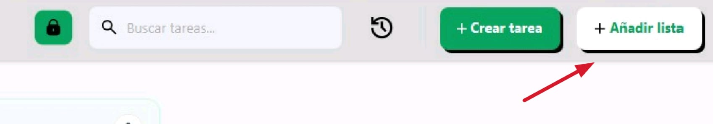

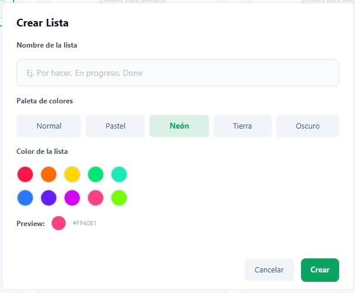

#### 1.2.9.1 Renombrar lista

Tambien es posible cambiar el titulo a una lista, pulsando en el icono de la izquierda de la papelera en la propia lista.

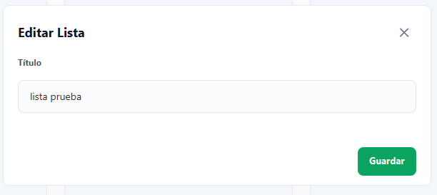

parece esta interfaz, en la que se puede modificar el titulo.

### 1.2.10. Mover tarjetas entre listas

Usando Drag and Drop se pueden mover tarjetas entre listas

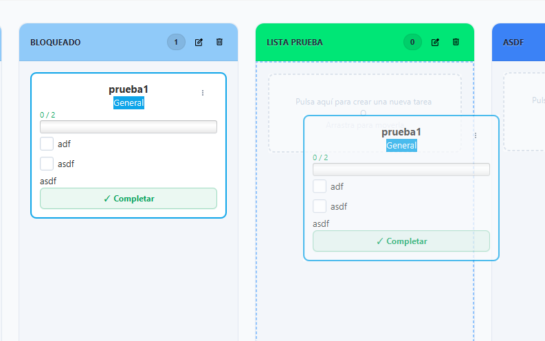